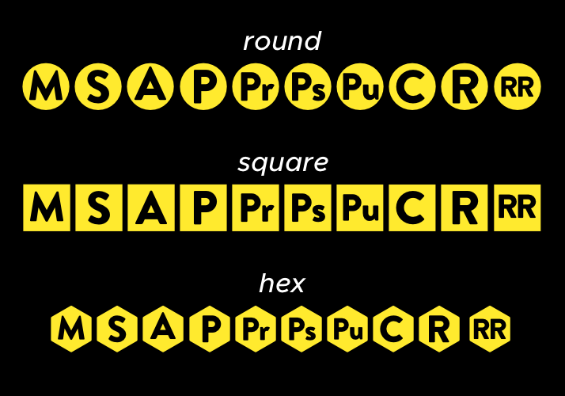

# Open Science Icons

The *Open Science Icons* typeface is a collection of icons related to Open Science practices.

The typeface currently contains the following icons.

## Live Example

You can see the icons in action [here](https://stefanocoretta.github.io/output/).

## Legend

- **M**: author manuscript, non-submitted manuscript, pre-print.
- **S**: submitted author manuscript, pre-print, author manuscript prior to peer-review.
- **A**: accepted manuscript, post-print, manuscript after peer-review.
- **P**: published manuscript, manuscript with journal formatting.
- **Pr**: pre-print, author manuscript, non-submitted manuscript, author manuscript prior to peer-review.
- **Ps**: post-print, accepted manuscript, manuscript after peer-review.
- **Pu**: published manuscript, manuscript with journal formatting.
- **C**: research compendium.
- **R**: pre-registration.
- **RR**: Registered Report.
